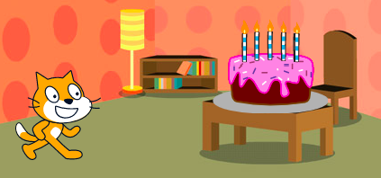
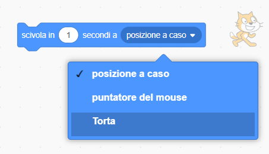
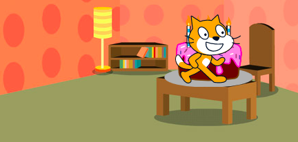

I blocchi `scivola`{:class="block3motion"} in Scratch possono essere utilizzati per spostare uno sprite sullo Stage.

Uno sprite può `scivolare`{:class="block3motion"} verso un punto specifico (coordinate), una posizione a caso ``{:class="block3motion"}, il puntatore del mouse ``{:class="block3motion"}, o un altro sprite.

Posiziona gli sprite nelle posizioni iniziali. Poi, seleziona lo sprite che vuoi far scivolare:



Trascina un blocco `scivola (1) secondi a x: y:`{:class="block3motion"} nell'area Codice, ma non collegarlo ancora a nessun altro blocco. Questo blocco conterrà le coordinate del punto di partenza e verrà usato più avanti per far tornare lo sprite al punto iniziale.

```blocks3
glide (1) secs to x: (-150) y:(-80) // your numbers will be different
```

Trascina un blocco `scivola (1) secondi a (posizione a caso v)`{:class="block3motion"} nell'area Codice e aggiungilo al tuo programma nel punto in cui vuoi fare muovere lo sprite.

Fai clic sul menu a tendina e seleziona il nome dello sprite verso il quale vuoi `scivolare`{:class="block3motion"}:



```blocks3
glide (1) secs to (Cake v)
```



Infine, trascina il blocco `scivola (1) secondi a x: y:`{:class="block3motion"}, già presente nell'area Codice, e aggiungilo al programma per `scivolare`{:class="block3motion"} al punto di partenza:

```blocks3
glide (1) secs to (Cake v)
glide (1) secs to x: (-150) y:(-80)
```
